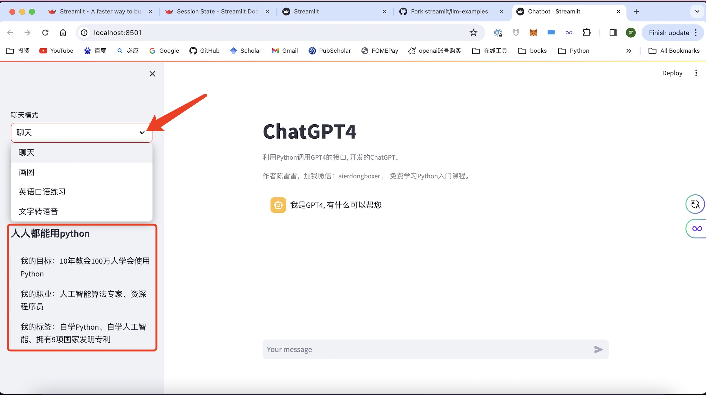

## 简介
使用Streamlit框架实现的ChatGPT4聊天工具，并且可以调用DALLE模型进行画图。

## 安装
### 获取openai api-key

按照以下步骤获取api-key:

1. 注册openai账号
2. 进入该网址https://platform.openai.com/account/api-keys.
3. 点击  `Create new secret key` 按钮创建api-key.
4. 复制api-key，将创建的api-key复制到config目录下的api_key.py文件中，放在双引号内


### 创建虚拟环境
在命令号执行以下命令，创建虚拟环境，并按照需要的python库

```sh
python -m venv .venv
source .venv/bin/activate
pip install -r requirements.txt
```
### 运行程序
完成以上配置之后，运行以下命令，启动服务
```sh
streamlit run Chatbot.py
```
## 使用方法

### 聊天模式
页面左侧有聊天模式，选择聊天那么就是和GPT4进行纯文字聊天，选择画图则是使用DALLE模型进行画图
### 聊天
在页面下方的输入框，输入你想和GPT4聊天的话，按回车按钮，就可以和GPT4聊天了。
### 画图
在页面下方的输入框，输入你想生成的图片的描述，按回车按钮，就可以生成图片了。
